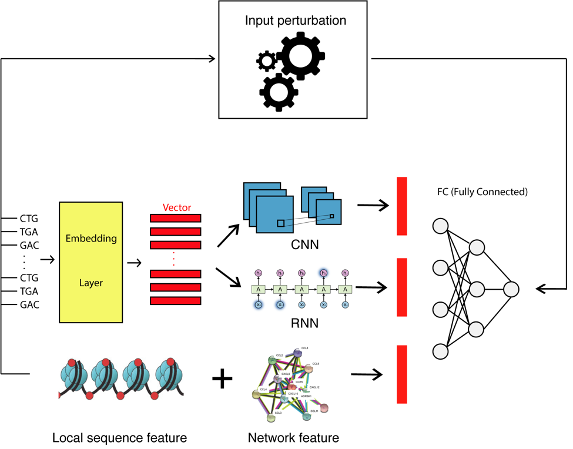

# seqCrispr

# Overview

This project is intended to generate a model for Crispr-Cas9 targeting efficiency prediction.

Below is the layout of the whole model.

<p align="center">
  
</p>

This model includes four components: 
* embedding layer
* convolutional neural network and recurrent neural network layer
* fully connected layer
* input perturbation layer.

# Requirement

* keras
* tensorflow
* h2o
* sklearn
* pandas
* numpy

# Usage
## Load model

change the model directory in config.py when old model need to be loaded for testing or transfer learning
```
transfer_learning = True
loaded_model_path = os.path.join(cur_dir, "dataset/best_model/<cellline>_lstm_model.h5")
```

When no model needs to be loaded, change to
```
transfer_learning = False
```

## Model training
Test old models only, change "training" in config.py
```
training = False
```
Training new models
```
training = True
```

## Run the program and get prediction result

Make sure the data is in dataset/<cellline>/ folder and execute
```
./run.sh dataset/<cellline>
```
